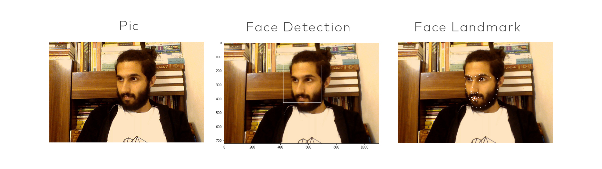
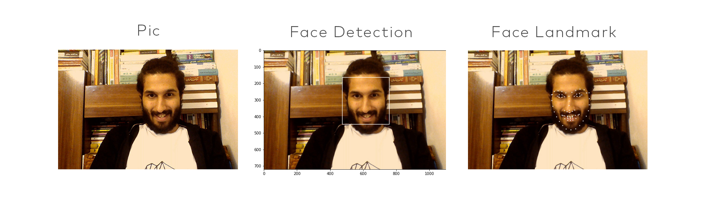
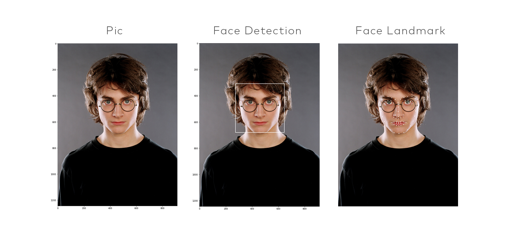

# face-detection
Face Detection and Landmark usage opencv, haar cascade algorithm and LBFmodel

## exports
{:height="50%" width="50%"}
{:height="50%" width="50%"}
{:height="50%" width="50%"}

## Model
[LBF model repository](https://raw.githubusercontent.com/kurnianggoro/GSOC2017/master/data/lbfmodel.yaml)
[Haar cascade model repository](https://raw.githubusercontent.com/opencv/opencv/master/data/haarcascades/haarcascade_frontalface_alt2.xml)
